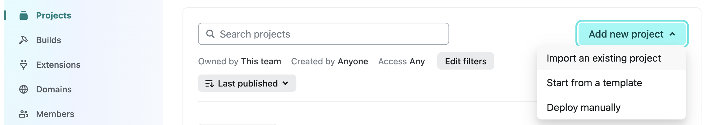
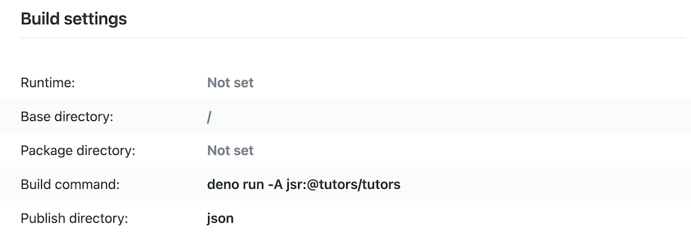

---
icon:
  type: flat-color-icons:org-unit
---
# Getting Started

*The basic model of Tutors*

---

[[toc]]

---

Tutors is a collection of open source components and services supporting the creation of transformative learning experiences using open web standards. It consists of two key components:

- *Generator:*  transforms a [folder of learning content](https://github.com/tutors-sdk/tutors-reference-course)  into a Tutors course

- *Reader*: presents a Tutors course as an intuitive, discoverable and attractive [Web experience](https://tutors.dev/course/reference-course)

These components are [developed in the open](https://github.com/tutors-sdk/tutors) by an active and friendly community, based on a clear [set of values](https://tutors.dev/note/tutors-reference-manual/unit-0/note-12).

# First Course

Visit [this course](https://tutors.dev/course/tutors-starter-course) to become familiar with the general structure of the learning experience. [Download the source](https://github.com/tutors-sdk/tutors-starter/archive/refs/heads/master.zip) for the course and unzip to a local folder. Spend a few minutes exploring the content of the folder using a good editor, for example [Sublime Text](https://www.sublimetext.com/).

Install [Deno](https://deno.com/),  a modern, secure runtime javascript engine. On Windows/Linux, this is the Deno install command:

~~~
irm https://deno.land/install.ps1 | iex
~~~

On Mac:

~~~
curl -fsSL https://deno.land/install.sh | sh
~~~

You can also create a free account on the [Netlify](https://www.netlify.com/) service.

# Publish to Netlify

Open a [command prompt/terminal at the course folder](https://www.groovypost.com/howto/open-command-window-terminal-window-specific-folder-windows-mac-linux/) you created above and enter the following command:

~~~bash
deno run -A jsr:@tutors/tutors
~~~

This should generate a response like this (shortened here):

~~~text
: tutors-starter :  Tutors Starter
--: topic-01 :  Simple Units
----: unit-1 : Main Lesson
------: book-a :  Objectives
------: talk-1-intro : Lecture 1
------: talk-2-explore : Lecture 2
----: unit-2 : Supporting Resources
------: archive : Resource 1
------: note-1 :  Note 1
------: web-1 : Web Site 1
...
----: unit-2 : Unit 6 Title
------: talk-1 : Lecture 10
------: web-1 : Zoom Morning Room
------: web-2 : Podcast
tutors-publish: 4.1.0
~~~

A new folder called **json** will be generated by the above command. Drag & Drop this **json folder** to Netlify using this [drop target site](https://app.netlify.com/drop/) (assuming you are logged in to Netlify) . This will publish the course on the web, generating a unique url which you can verify almost immediately.  You can [customise the free domain name](https://stevemats.medium.com/how-to-rename-netlifys-default-subdomain-name-e2d493e40d6e) directly on Netlify.

If you make any changes to the course source folder, then you must proceed through the generation (*deno run -A jsr:@tutors/tutors*) and publishing (drag & drop) to redeploy the course. Be sure to overwrite the existing course on Netlify, unless you want a new course. In this case, locate the deployment panel for the newly created project on Netlify and drag & drop the json folder there.

If you wish to set up a publication pipeline from a GitHub repo, then you can link the Netlify project to your course repo such that Netlify will automatically re publish the course whenever you update on Github.

This will require you to import the project into Netlify:

Once imported, the **Build Command** should be:

~~~
deno run -A jsr:@tutors/tutors
~~~

Then **Publish directory**:

~~~
json
~~~

Any push to the repo will trigger a rebuild of the site.

# Publish to Vercel

Create an account on [Vercel](https://vercel.com). Once logged in, create a new project. You will need to link the project to a github repo containing the tutors course. Include the following file in your courese:

## vercel.json

~~~json
{
  "version": 2,
  "buildCommand": "npx -y deno-bin@latest run -A jsr:@tutors/tutors",
  "outputDirectory": "json",
  "framework": null
}
~~~

Whenever you push an update to the repo, it will build and deploy on Vercel.

For the hobby (free) account, your course repo must be public.

# Alternative Static Site Publish

There is secondary publication mechanism, which is invoked as above, but with a different command:

~~~bash
deno run -A jsr:@tutors/tutors-lite
~~~

This will also generate a folder of content in the course folder - this time in a **html** subfolder. You can open this folder and load the **index.html** therein in a browser (generally just double click).  This will open a local version of the course offline (on your workstation only). This is an example here:

- [Tutors Reference Course](https://tutors-reference-course-html.netlify.app/index.html)

This does not provide the complete Tutors user experience, but can be a useful as a backup, an alternative UX and also perhaps as the basis for an archive of the course that can be distributed as a zip file (compress and distribute the html folder only) when a course concludes. The archive can be opened by the students independently, with all course assets held locally, except for videos. The **html** folder can also be published to any web server, including Netlify using the same process as outlined above.

# More Course Examples

The first course example above is a typicaly tutors course, with a basic structure. This example:

- [Alternative Layouts](https://tutors.dev/course/layout-reference-course)

... incorporates different layouts + nesting of learning objects in various confurations. Download the source [here](https://github.com/tutors-sdk/layout-reference-course/archive/refs/heads/main.zip) 

This example is a complete reference course illustrating all Tutors features:

- [Reference Course](https://tutors.dev/course/reference-course)

Download the source [here](https://github.com/tutors-sdk/tutors-reference-course/archive/refs/heads/main.zip) 

