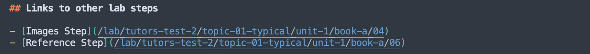

---
icon:
  type: flat-color-icons:timeline
---

# Learning Resources

*Enumerating the Tutors Learning Objects*

[[toc]]

## Learning Resources

There are 2 broad types of learning resources

- Card Resources
- Panel Resources

Typically card or panel learning resources are child folders within topic, unit or side folders.

## Card Resources

These resources are represented by simple cards that can appear in a topic, unit or side:

| Example Resource | Display | Cards |
| ---------------- | ------- | ----- |
| [Standard presentation in pdf format](https://github.com/tutors-sdk/tutors-reference-course/tree/main/topic-01-typical/unit-1/talk-1-intro)             | [Lecture 1](https://tutors.dev/talk/reference-course/topic-01-typical/unit-1/talk-1-intro) | [Talks](https://tutors.dev/wall/talk/reference-course) |
| [Single web page, authored in markdown ](https://github.com/tutors-sdk/tutors-reference-course/tree/main/topic-01-typical/unit-2/note-1)                | [Note 1](https://tutors.dev/note/reference-course/topic-01-typical/unit-2/note-1)          | [Notes](https://tutors.dev/wall/note/reference-course) | 
| [Step by step lab instructions, authored in markdown  ](https://github.com/tutors-sdk/tutors-reference-course/tree/main/topic-01-typical/unit-1/book-a) | [Lab 1](https://tutors.dev/lab/reference-course/topic-01-typical/unit-1/book-a)            | [Labs](https://tutors.dev/wall/lab/reference-course) |
| [Link to a web site  ](https://github.com/tutors-sdk/tutors-reference-course/tree/main/topic-01-typical/unit-2/web-1)                                   | [Web Site](https://tutors.dev)                                                                    | [Web Links](https://tutors.dev/web/talk/reference-course) |
| [Downloadable zip file of resources  ](https://github.com/tutors-sdk/tutors-reference-course/tree/main/topic-07-reference/archive)                      | [Archive 1](https://tutors.dev/wall/archive/reference-course)                              | [Archives](https://tutors.dev/archive/talk/reference-course) |
| [Link to a GitHub repository  ](https://github.com/tutors-sdk/tutors-reference-course/tree/main/topic-01-typical)                                       | [Github Repo 1](https://github.com/tutors-sdk/tutors)                                             | [Repos](https://tutors.dev/wall/repo/reference-course) | 

### Talk 

A talk is a PDF presentation, document or other pdf formatted resource.

| Example Resource | Display | Cards |
| ---------------- | ------- | ----- |
| [Standard presentation in pdf format](https://github.com/tutors-sdk/tutors-reference-course/tree/main/topic-01-typical/unit-1/talk-1-intro) | [Lecture 1](https://tutors.dev/talk/reference-course/topic-01-typical/unit-1/talk-1-intro) | [Talks](https://tutors.dev/wall/talk/reference-course) |

 The pdf file, markdown description and image file must all have the same file name, which can be whatever you choose. 

| File name        | Purpose                                                      |
| ---------------- | ------------------------------------------------------------ |
| introduction.md  | Title + short summary for the talk. The file can have any suitable name, but must be .md file type |
| introduction.png | Image for card. File name must be same as .md file. File type can be .png, .jpg, or .jpeg |
| introduction.pdf | Pdf to be rendered if the card is selected. The name must match the .md file name precicely |

The .md file provides the card title + subtitle:

~~~markdown
Lecture 1

A short summary of the talk, no more than two sentences.
~~~

### Note 

A note is a full web page, authored in markdown.

| Example Resource | Display | Cards |
| ---------------- | ------- | ----- |
| [Single web page, authored in markdown ](https://github.com/tutors-sdk/tutors-reference-course/tree/main/topic-01-typical/unit-2/note-1) | [Note 1](https://tutors.dev/note/reference-course/topic-01-typical/unit-2/note-1) | [Notes](https://tutors.dev/wall/note/reference-course) | 

Markdown is a simple text format for authoring web content:

- <https://www.markdownguide.org/basic-syntax/>

If you choose to include local images or links to zipped archives you wish to be distributed with the note, you must include these in the note folder in specific subfolders:

| Resource   | Purpose  |
| ---------- | -------- |
| note.md    | The content of the note. Any suitable name, type must be .md |
| note.png   | Image for card. File name must be same as .md file. File type can be .png, .jpg, or .jpeg |
| img        | A folder containing Images used by the note |
| archives   | A folder contains any zipped archives referred to in the note |

Image links can be structured to in include relative references to the image. E.g:

The linked images must be included in the img folder in the note resource. Similairly, if you wish to distributed a zipped archive of learning resources, include the zip file(s) in the archives folder, and link like this:

Links to external resources can be included with conventional web links.

### Tutorial 

A note is a full web page, authored in markdown. Is represented in a different category, with a different colour/icon from Notes

| Example Resource | Display | Cards |
| ---------------- | ------- | ----- |
| [Single web page, authored in markdown](https://github.com/tutors-sdk/tutors-reference-course/tree/main/topic-07-reference/tutorial-2) | [Tutorial 2](https://tutors.dev/tutorial/reference-course/topic-07-reference/tutorial-2)|[Tutorials](https://tutors.dev/wall/tutorial/reference-course)

Markdown is a simple text format for authoring web content:

- <https://www.markdownguide.org/basic-syntax/>

If you choose to include local images or links to zipped archives you wish to be distributed with the note, you must include these in the note folder in specific subfolders:

| Resource   | Purpose  |
| ---------- | -------- |
| tutorial.md    | The content of the note. Any suitable name, type must be .md |
| tutorial.png   | Image for card. File name must be same as .md file. File type can be .png, .jpg, or .jpeg |
| img        | A folder containing Images used by the note |
| archives   | A folder contains any zipped archives referred to in the note |

Image links can be structured to in include relative references to the image. E.g:

The linked images must be included in the img folder in the note resource. Similairly, if you wish to distributed a zipped archive of learning resources, include the zip file(s) in the archives folder, and link like this:

Links to external resources can be included with conventional web links.

### PDF Tutorial

A pdf presented in portrait orientation, intended for problem sets or worksheets. Is categorised with the Tutorial learning objects (see above).

| Example Resource | Display | Cards |
| ---------------- | ------- | ----- |
| [Document pdf format](https://github.com/tutors-sdk/tutors-reference-course/tree/main/topic-07-reference/tutorial-1) | [Tutorial-1](tutors.dev/tutorial/reference-course/topic-07-reference/tutorial-1)| [Tutorials](https://tutors.dev/wall/tutorial/reference-course) |

 The pdf file, markdown description and image file must all have the same file name, which can be whatever you choose. 

| File name        | Purpose                                                      |
| ---------------- | ------------------------------------------------------------ |
| tutorial.md  | Title + short summary for the talk. The file can have any suitable name, but must be .md file type |
| tutorial.png | Image for card. File name must be same as .md file. File type can be .png, .jpg, or .jpeg |
| tutorial.pdf | Pdf to be rendered if the card is selected. The name must match the .md file name precicely |

The .md file provides the card title + subtitle:

#### TOC

If the note content includes heading and subheading, then you can insert an automatic Table of Contents via this text:

~~~markdown
[[toc]]
~~~

An example of this can be seen [in action here](https://tutors.dev/note/reference-course/topic-07-reference/note-2), this is [the source](https://github.com/tutors-sdk/tutors-reference-course/blob/main/topic-07-reference/note-2/my-note.md) of that example.  Usually you would place this at the top of the note.

### BookLab

A series of steps/instructions, authored in Markdown

| Example Resource | Display | Cards |
| ---------------- | ------- | ----- |
| [Step by step lab instructions, authored in markdown  ](https://github.com/tutors-sdk/tutors-reference-course/tree/main/topic-01-typical/unit-1/book-a) | [Lab 1](https://tutors.dev/lab/reference-course/topic-01-typical/unit-1/book-a) | [Labs](https://tutors.dev/wall/lab/reference-course) |

Markdown is a simple text format for authoring web content:

- <https://www.markdownguide.org/basic-syntax/>

Each step in the lab is held in a separate markdown file. The step will have a full title, extracted from the first line of the step file. It will also have a short title, used for constrained (mobile) screen widths.

The step files are named with three dot separated segments as follows:

- [sort-key].[short-title].md

Where:

- [sort-key] ensures the step sequential position, sorted alphabetically/numerically. Typlicaly you might use a sequence like: 01, 02, 03, 04 etc...
- [short-title] is a title used for constrained screen widths

For example:

- 00.Lab-01.md
- 01.01.md
- 02.02.md
- 03.03.md

The title + summary for the lab card is extracted from the short title for the first step. In the above example, the lab navigation side bar would be:

- Lab-01
- 01
- 02
- 03

Image links can be structured in include relative references to the image. E.g:

The linked images must be included in the img folder in the lab. Similairly, if you wish to distributed a zipped archive of learning resources, include the zip file(s) in the archives folder, and link like this:

#### Links within Labs

Links to external resources can be included with conventional web links.

If you wish to link to another step in the same lab, identify the url for the step, for instance:

~~~hmtl
https://tutors.dev/lab/tutors-test-2/topic-01-typical/unit-1/book-a/04
~~~

... and formulate a link, trimming the `https://tutors.dev`, leaving the remaining segments:

~~~
/lab/tutors-test-2/topic-01-typical/unit-1/book-a/04
~~~

You can then formulate a link using the conventional markdown link syntax:

#### Auto Numbering

You may prefer all steps in all your labs to be autonumbered. This will prepend a number, starting at 01, to all steps

~~~
labStepsAutoNumber: true
~~~

This is independent of the 'sort-key' segment in the lab step name.

### PDFLab

Problem or exercises sheet, authored as a PDF. This resources Will be presented and grouped with Books/Labs. They are structured identically to Talks, except the containing folder name starts with `book-*`.

| Example Resource | Display | Cards |
| ---------------- | ------- | ----- |
| [Problem or exercises sheet, authored as a PDF  ](https://github.com/tutors-sdk/tutors-reference-course/tree/main/topic-02-side/side-unit/book-c) | [Problem Sheet 1](https://tutors.dev/lab/reference-course/topic-02-side/side-unit/book-c) | [Labs](https://tutors.dev/wall/lab/reference-course) |

### Web 

A simple link to an external web resource.

| Example Resource | Display | Cards |
| ---------------- | ------- | ----- |
| [Link to a web site  ](https://github.com/tutors-sdk/tutors-reference-course/tree/main/topic-01-typical/unit-2/web-1) | [Web Site](https://tutors.dev) | [Web Links](https://tutors.dev/web/talk/reference-course) |

Three files are required:

| Resource   | Purpose  |
| ---------- | -------- |
| web-link.md  | Title + short summary for the link. The file can have any suitable name, but must be .md file type |
| web-link.png | Image for card. File name must be same as .md file. File type can be .png, .jpg, or .jpeg |
| weburl | the full url for the resource |

### Podcast 

A podcast player, currenty provided by Spotify

| Example Resource | Display | Cards |
| ---------------- | ------- | ----- |
| [Podcast](https://tutors.dev/topic/reference-course/topic-09-podcasts) | [Podcast Player](https://github.com/tutors-sdk/tutors-reference-course/tree/main/topic-09-podcasts/side-unit/podcast) |  [Podcasts](https://tutors.dev/wall/podcast/reference-course) |

Three files are required:

| Resource   | Purpose  |
| ---------- | -------- |
| podcast.md  | Title + short summary for the podcast. The file can have any suitable name, but must be .md file type |
| episode | the podcast episode identifier|

Currently supports the Spotify player, which requires the spotify episode id in this format:

~~~yaml
spotify=722LWsc3uWc0zAqUHP8QHs
~~~

You can identify this id by locating the podcast on Spotify and select "Share->Copy link to episode". This should look like:

~~~yaml
https://open.spotify.com/episode/3cqFe6wRbaadmPosSwckXh?si=8e60d1b6aa884327
~~~

For the above, this would be the episode file:

~~~yaml
spotify=3cqFe6wRbaadmPosSwckXh
~~~

### Archive  

A link to a downloadable archive (zip).

| Example Resource | Display | Cards |
| ---------------- | ------- | ----- |
| [Downloadable zip file of resources  ](https://github.com/tutors-sdk/tutors-reference-course/tree/main/topic-07-reference/archive) | [Archive 1](https://tutors.dev/wall/archive/reference-course) | [Archives](https://tutors.dev/archive/talk/reference-course) |

The archive is bundled with the course source and hosted with the course resources.

| Resource   | Purpose  |
| ---------- | -------- |
| archvive.md  | Title + short summary for the archive. The file can have any suitable name, but must be .md file type |
| archive.png | Image for card. File name must be same as .md file. File type can be .png, .jpg, or .jpeg |
| archive.zip | The archive that will be downloaded if the card selected |

### Github 

A link to an GitHub repository.

| Example Resource | Display | Cards |
| ---------------- | ------- | ----- |
| [Link to a GitHub repository  ](https://github.com/tutors-sdk/tutors-reference-course/tree/main/topic-01-typical) | [Github Repo 1](https://github.com/tutors-sdk/tutors) | [Repos](https://tutors.dev/wall/repo/reference-course) | 

Three files are required:

| Resource   | Purpose  |
| ---------- | -------- |
| github.md  | Title + short summary for the GitHib repo. The file can have any suitable name, but must be .md file type |
| github.png | Image for card. File name must be same as .md file. File type can be .png, .jpg, or .jpeg |
| githubid   | Full url of the repo |

## Panel Resources

Panels appear directly in a unit or topic, and are not represented by a separate card. Instead, their contents are rendered directly onto the parent topic/unit/side.

| Example Resource | Display | 
| ---------------- | ------- | 
| [A full screen width video, hosted in YouTube or HEANet](https://github.com/tutors-sdk/tutors-reference-course/tree/main/topic-03-media/panelvideo-1) | [Main Video](https://tutors.dev/topic/reference-course/topic-03-media)     |
| [Full screen width  presentation in pdf format    ](https://github.com/tutors-sdk/tutors-reference-course/tree/main/topic-05-panel-talk/paneltalk)    | [Main Talk](https://tutors.dev/topic/reference-course/topic-05-panel-talk) | 
| [Full screen width note](https://github.com/tutors-sdk/tutors-reference-course/tree/main/topic-04-panel-note/panelnote)                               | [Main Note](https://tutors.dev/topic/reference-course/topic-04-panel-note) | 

### Panelvideo 

A video to be displayed directly on the topic or unit resource.

| Example Resource | Display | 
| ---------------- | ------- | 
| [A full screen width video, hosted in YouTube or HEANet](https://github.com/tutors-sdk/tutors-reference-course/tree/main/topic-03-media/panelvideo-1) | [Main Video](https://tutors.dev/topic/reference-course/topic-03-media) |

Two files are required:

| Resource   | Purpose  |
| ---------- | -------- |
| video.md   | Title for the video. The file can have any suitable name, but must be .md file type |
| videoid    | id of the video |

See video section below for format of this videoid file.

### Paneltalk 

A PDF document to be displayed directly on the parent resource.

| Example Resource | Display | 
| ---------------- | ------- | 
| [Full screen width  presentation in pdf format    ](https://github.com/tutors-sdk/tutors-reference-course/tree/main/topic-05-panel-talk/paneltalk) | [Main Talk](https://tutors.dev/topic/reference-course/topic-05-panel-talk) | 

Two files are required:

| Resource   | Purpose  |
| ---------- | -------- |
| talk.md   | Title for the document. The file can have any suitable name, but must be .md file type |
| talk.pdf  | The .PDF to display. Its name must be the same as the .md file |

### Panelnote 

A panel note is a full web page layed out directly on the parent resource.

| Example Resource | Display | 
| ---------------- | ------- | 
| [Full screen width note](https://github.com/tutors-sdk/tutors-reference-course/tree/main/topic-04-panel-note/panelnote) | [Main Note](https://tutors.dev/topic/reference-course/topic-04-panel-note) | 

The content is authored in markdown using the basic syntax:

- <https://www.markdownguide.org/basic-syntax/>

The content is in a single file, images and archives may also be included:

| Resource   | Purpose  |
| ---------- | -------- |
| note.md    | The content of the note. Any suitable name, type must be .md |
| img        | A folder containing Images used by the note |
| archives   | A folder contains any zipped archives referred to in the note |

Image links can be structured in include relative references to the image. E.g:

The linked images must be included in the img folder in the note resource. Similairly, if you wish to distributed a zipped archive of learning resources, include the zip file(s) in the archives folder, and link like this:

Links to external resources can be included with conventional web links.

### Videos

Panelvideos above are the primary mechanism for displaying videos prominently. The video is referenced in file always called:

- videoid

Videos are usually hosted on Youtube - and you will need a link to the video in order to embed in a tutors course. A typical YouTube URL looks like this:

~~~url
https://www.youtube.com/watch?v=Hfw1lbErjws
~~~

You will typically use the video id:

~~~
Hfw1lbErjws
~~~

... which is the last string after the `v=`. This is the contents of the videoid file.

However, this videoid file can be dropped into most learning resources. If a resource has this file, then a video play button will feature in the Card for the resource, which will trigger the video player. 

#### Video Talks

| Example Resource                                             | Display                                                      |
| ------------------------------------------------------------ | ------------------------------------------------------------ |
| [Video Only Talk](https://github.com/tutors-sdk/tutors-reference-course/tree/main/topic-03-media/unit-1/talk-3) | [Lecture 7](https://tutors.dev/video/reference-course/topic-03-media/unit-1/talk-3/x09E7b2ESE8?start=1068&1370) |

For Talk resources only, it is possible to drop the PDF completely and just include the video only. The card will display as with a PDF 

#### Video Chapters

Youtube supports start/end times when linking to a video. This is via appending a start/end in seconds to the videoid file

| Example Resource                                             | Display                                                      |
| ------------------------------------------------------------ | ------------------------------------------------------------ |
| [Video Chapter](https://github.com/tutors-sdk/tutors-reference-course/tree/main/topic-03-media/unit-1/talk-2) | [Lecture 6](https://tutors.dev/video/reference-course/topic-03-media/unit-1/talk-2/x09E7b2ESE8?start=106&286)) |

For example, this id specifies a start time and end time in second (separated by &):

~~~bash
x09E7b2ESE8?start=106&286
~~~

On youtube, this typically works best if the Youtube description also contains chapter information. For example, on YouTube Studio, chapters information can be included by incorporating start / end times into the video description. For example:

~~~bash
Introduction 00:00:00
Svelte Core Concepts 00:02:54
Svelte Components 0:19:49
Donation App 00:27:55
Donation-Hapi V1 00:34:24
~~~

For the above, the associated videoid files for each chapter would look like this:

~~~bash
9Srf_ydMdL0?start=0&174
9Srf_ydMdL0?start=174&1189
9Srf_ydMdL0?start=1189&1675
9Srf_ydMdL0?start=1675&2064
9Srf_ydMdL0?start=2064&6348
~~~

#### HEANet Hosted Videos

If you require an alternative to Youtube, you can use the HEANet service.

| Example Resource                                             | Display                                                      |
| ------------------------------------------------------------ | ------------------------------------------------------------ |
| [Heanet Video](https://github.com/tutors-sdk/tutors-reference-course/tree/main/topic-03-media/unit-2-heanet) | [HeaNet video example](https://tutors.dev/topic/reference-course/topic-03-media)) |

Videos can be uploaded here:

- <https://media.heanet.ie/>

If you wish to use this service, then your videoid file should look like this:

~~~bash
heanet=7e4f1e9afedb40d5996d0703702eaaa4
~~~

The id will be generated when you upload the video to the HEAnet media service.

## Latex

Notes and Books can have Latex content, implemented using the [Katex](https://katex.org/) component. 

| Example Resource                                             | Display                                                      |
| ------------------------------------------------------------ | ------------------------------------------------------------ |
| [Latex](https://github.com/tutors-sdk/tutors-reference-course/blob/main/topic-01-typical/unit-1/book-a/05.05.md) | [Latex Example](https://tutors.dev/lab/reference-course/topic-01-typical/unit-1/book-a/05) |

You can express Latex content between "$" symbols. For example:

~~~latex
$
x=\frac{ -b\pm\sqrt{ b^2-4ac } } {2a}
$
~~~

Will render as:

$
x=\frac{ -b\pm\sqrt{ b^2-4ac } } {2a}
$

You can also express content inline, so thisL

~~~latex
This is an inline example: $c = \pm\sqrt{a^2 + b^2}$ with text before and after
~~~

This will render link this:

This is an inline example: $c = \pm\sqrt{a^2 + b^2}$ with text before and after.

## Ordering Learning Resources

For a topic, unit or side resources, the ordering of the cards is as follows:

- talk
- lab
- note
- web
- github
- archive

This can be customised via the introduction of [FrontMatter](https://docs.zettlr.com/en/core/yaml-frontmatter/) sections in the corresponding markdown files. 

| Example Resource | Display | 
| ---------------- | ------- | 
| [Ordering](https://github.com/tutors-sdk/tutors-reference-course/tree/main/topic-08-ordering)| [Ordering Example](https://tutors.dev/topic/reference-course/topic-08-ordering) | 

This should contain an "order" number, which dictates the sequencing for the cards.

~~~yaml
---
order: 1
---
~~~

If the resouce is a Lab, then the first step should include the FrontMatter/order paramater.

## SVG Icons

If no image file is found in a resource, then Tutors will look to display an SVG Icon instead. This Icon is drawn from the Iconify collection:

- <https://icon-sets.iconify.design/>

| Example Resource                                             | Display                                                      |
| ------------------------------------------------------------ | ------------------------------------------------------------ |
| [Icon based cards](https://tutors.dev/topic/reference-course/topic-09-svg) | [Iconify](https://github.com/tutors-sdk/tutors-reference-course/tree/main/topic-09-svg) |

You can search for an icon in that collection, locate the reference and include this + a colour in a [FrontMatter](https://docs.zettlr.com/en/core/yaml-frontmatter/) section for the Learning Resource. For example:

~~~markdown
---
icon:
  type: vscode-icons:file-type-pdf2
---
~~~

The above icon is drawn from this resource:

- <https://icon-sets.iconify.design/vscode-icons/file-type-pdf2/>

For monochrome icons, you can also specify the icon colour:

~~~markdown
---
icon:
  type: bi:filetype-pptx
  color: green
---
~~~

## Image resizing

Some images you mau choose to use may be hi-resolution, appearing to be super sized on the canvas. This can be a particular issue with screen shots. This service here:

- <https://nodeca.github.io/pica/demo>

Allows you to resize the image to a suitable 'canvas' size.

## Reference Course

A reference course is located here:

- <https://github.com/tutors-sdk/tutors-reference-course>

and is published here:

- <https://tutors.dev/course/reference-course>

This course illustrates all Tutors featues. It can be downloaded here:

- <https://github.com/tutors-sdk/tutors-reference-course/archive/refs/heads/main.zip>

## Tutors Time

With authentication enabled, the user will be required to authenticate using a pre-existing GitHub account. Tutors will then record how much time each view is active (in minutes) and send this to the TutorsTime data store. This can be viewed via the TutorsTime feature on the course Navigator. This data is available to  student + the instructor of the course, but not to other students. No other data is gathered, nor is this data transmitted anywhere other than the TutorsTime data store. 

This data is gathered largely for course management purposes. For example, time spent on lab steps is valuable intelligence that will feed into the design of the labs. Also, averaged lab times across the course can help course authors better understand course load and relative load across modules.

The numbers presented are an estimate of the number of minutes the lab is visible in the browser - excluding when the browser is minimised or in an inactive tab.

## TutorsLive

A companion to Tutors Time, this feature lists the students currently interacting with a module. The purpose of the feature is to simulate the presence dimension of a typical timetabled 'practical' in traditional module delivery. In a practical session, students often work on their lab materials in a single physical space. They may work alone or collaborate - but they are at least aware of others in the room, and might have a general idea as to what fellow students are working on.

This experience can generate a sense of community and collective effort. It can also offer opportunities for mutual learning. Starting from from when you visit the course web - Tutors Live will list students who are interacting with the course - at topic level or below. It will list the topic name + the lab if interacting with a lab.

The display starts when you visit course web. No interaction data is shown prior to this time. If no activity is detected for 5 minutes, then the entry for the student is removed from the display. There is a checkbox to opt out - in this case you will not appear in the live display until you check it again. This will not affect other metrics.

