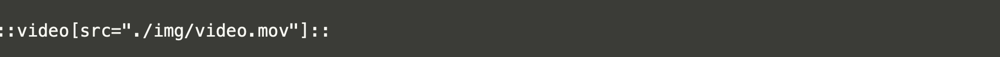

---
icon:
  type: flat-color-icons:slr-back-side
---

[[toc]]

# Videos

*How to include and configure videos*

## Panelvideos

Panelvideos above are the primary mechanism for displaying videos prominently. The video is referenced in file always called:

- videoid

Videos are usually hosted on Youtube - and you will need a link to the video in order to embed in a tutors course. A typical YouTube URL looks like this:

~~~url
https://www.youtube.com/watch?v=Hfw1lbErjws
~~~

You will typically use the video id:

~~~
Hfw1lbErjws
~~~

... which is the last string after the `v=`. This is the contents of the videoid file.

However, this videoid file can be dropped into most learning resources. If a resource has this file, then a video play button will feature in the Card for the resource, which will trigger the video player. 

## Video Talks

| Example Resource                                             | Display                                                      |
| ------------------------------------------------------------ | ------------------------------------------------------------ |
| [Video Only Talk](https://github.com/tutors-sdk/tutors-reference-course/tree/main/topic-03-media/unit-1/talk-3) | [Lecture 7](https://tutors.dev/video/reference-course/topic-03-media/unit-1/talk-3/x09E7b2ESE8?start=1068&1370) |

For Talk resources only, it is possible to drop the PDF completely and just include the video only. The card will display as with a PDF 

## Videos in Labs & Notes

You can have either short videos, that can be bundled into the img folder, or you can have a youtube player.

### Short Video

An example of a short bundled video:

::video[src="./img/video.mov"]::

The above is displayed using a convenient shortcut like this:

You can also associate a "poster" image, displayed before the image is played:

::video[src="./img/video.mov" poster="img/01.png"]::

The video file and the poster must be in the img folder.

### Embedded Youtube Player

You will need the id from Youtube, then include like this:

This is how it will look:

::video[src="O6Jh_1bxDs4"]::

## Video Chapters on Youtube

Youtube supports start/end times when linking to a video. This is via appending a start/end in seconds to the videoid file

| Example Resource                                             | Display                                                      |
| ------------------------------------------------------------ | ------------------------------------------------------------ |
| [Video Chapter](https://github.com/tutors-sdk/tutors-reference-course/tree/main/topic-03-media/unit-1/talk-2) | [Lecture 6](https://tutors.dev/video/reference-course/topic-03-media/unit-1/talk-2/x09E7b2ESE8?start=106&286)) |

For example, this id specifies a start time and end time in second (separated by &):

~~~bash
x09E7b2ESE8?start=106&286
~~~

On youtube, this typically works best if the Youtube description also contains chapter information. For example, on YouTube Studio, chapters information can be included by incorporating start / end times into the video description. For example:

~~~bash
Introduction 00:00:00
Svelte Core Concepts 00:02:54
Svelte Components 0:19:49
Donation App 00:27:55
Donation-Hapi V1 00:34:24
~~~

For the above, the associated videoid files for each chapter would look like this:

~~~bash
9Srf_ydMdL0?start=0&174
9Srf_ydMdL0?start=174&1189
9Srf_ydMdL0?start=1189&1675
9Srf_ydMdL0?start=1675&2064
9Srf_ydMdL0?start=2064&6348
~~~

## HEANet Hosted Videos

If you require an alternative to Youtube, you can use the HEANet service.

| Example Resource                                             | Display                                                      |
| ------------------------------------------------------------ | ------------------------------------------------------------ |
| [Heanet Video](https://github.com/tutors-sdk/tutors-reference-course/tree/main/topic-03-media/unit-2-heanet) | [HeaNet video example](https://tutors.dev/topic/reference-course/topic-03-media)) |

Videos can be uploaded here:

- <https://media.heanet.ie/>

If you wish to use this service, then your videoid file should look like this:

~~~bash
heanet=7e4f1e9afedb40d5996d0703702eaaa4
~~~

The id will be generated when you upload the video to the HEAnet media service.
