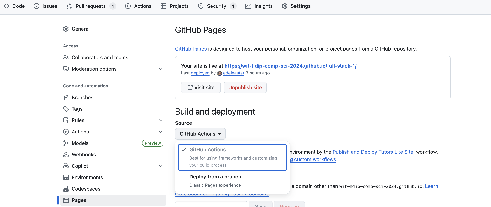
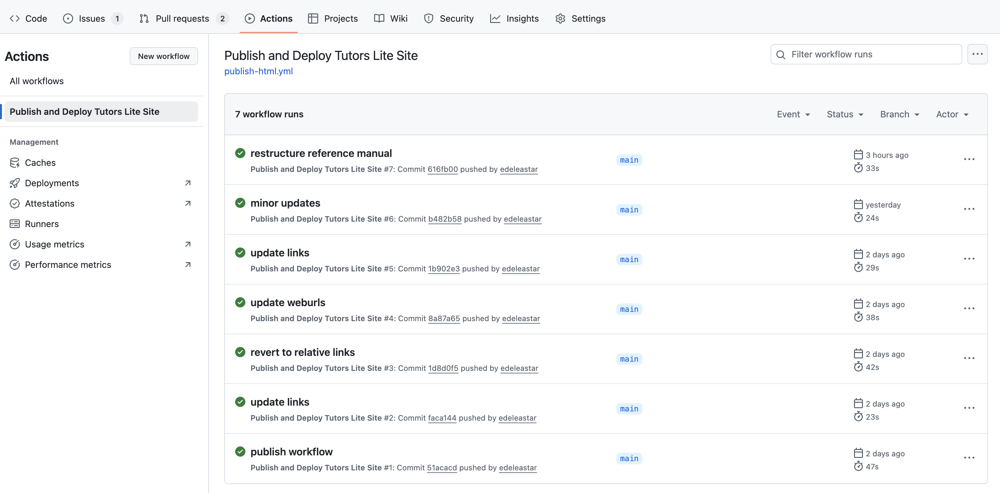
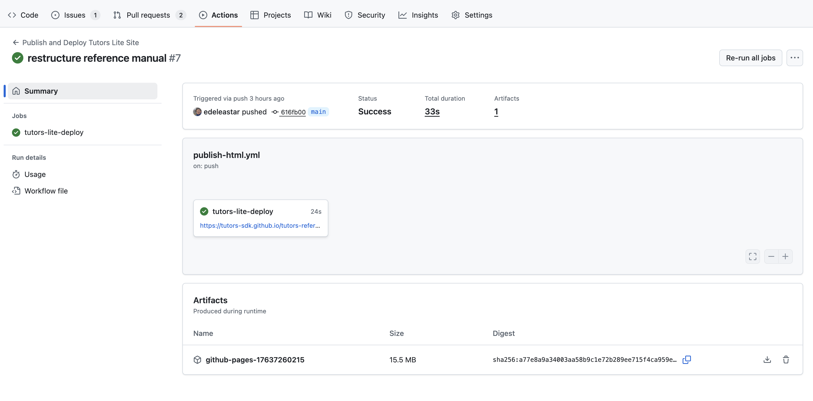
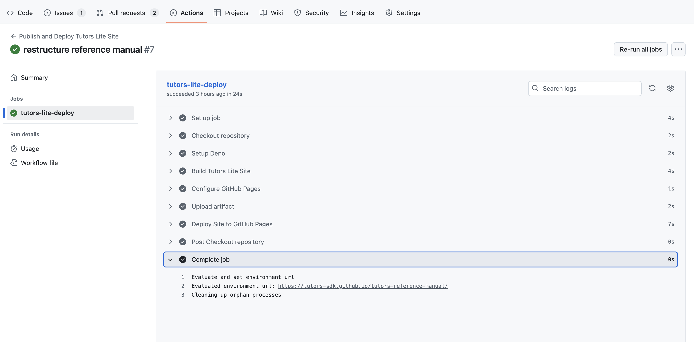

# Tutors Lite

*The TutorsLite alternative*

[[toc]]

## 1. What is Tutors Lite?

As well as rendering core Tutors course content, the default tutors experience encompasses:

- Authentication
- Tutors Time 
- Tutors Live
- Course Themes 
- Code Themes
- Alternative card styles
- Calendar

All of the above are delivered via the Tutors Reader application. This is a full stack web application hosted at https://tutors.dev. A course must be published on Netlify for the Tutors Reader to be able to read and render it.

Tutors Lite is a lightweight alternative which does not require Tutors Reader. This means a course can be loaded locally (before publication) and can be deployed on any web server. The format of the course 'source' is identical, although some aspects will be ignored (auth, calendar). The generated course web will not have any of the features listed above - but it will match the overall learning experience for the core course content.

## 2. Why would I use TutorsLite?

- To have a local browsable version of a course before running a full publication cycle. The format will more or less match the full Tutors UX.

- Speed: the lite version will be significantly faster, as no web application is required

- Independence: your course does not depend on the reader and the associated services the Tutors Reader in turn depends on (e.g. DNS, Hosting, Database, communication infrastructure etc.)

- Choose your own host. Publication to GitHub Pages is discussed below, but any provider will do (including Netlify)

- Course archiving: you can zip up and perhaps distribute to students a 'frozen' copy or a course at the conclusion of a semester.

- A backup - if there is some issue with Tutors Reader, or if the Tutors Reader application is blocked for some reason.

## 3. How do I use Tutors Lite:

This is the command to build a TutorsLite version:

~~~bash
deno run -A jsr:@tutors/tutors-lite
~~~

This will also generate a folder of content in the course folder - this time in a **html** subfolder. You can open this folder and load the **index.html** therein in a browser (generally just double click).  

## 4. Any examples I can look at?

Here is a the Lite version of a course:

- <https://wit-hdip-comp-sci-2024.github.io/full-stack-1/>

This is the full Tutors experience for the same course:

- <https://tutors.dev/course/wit-hdip-comp-sci-2024-full-stack-1>

## 5. How would I publish a TutorsLite version on Netlify?

Any hosing provider for simple web sites should do. If you want to try on Netlify, then these are the key settings:

~~~
Build command     : deno run -A jsr:@tutors/tutors-lite
Publish directory : html
~~~

## 6. How would I publish a TutorsLite version on Github Pages?

If you have your course on GitHub - and the course repo is public - you can set up the repo such that any git push will also publish the TutorsLite version as a web site hosted on the [Github Pages](https://docs.github.com/en/pages/getting-started-with-github-pages/what-is-github-pages) facility on your repo. Here is how to do this.

- Enable Gh-pages for the repo: On github.com for your course repo go to Settings->Pages and selct Build & Deployment -> GitHub Actions

- Create a new folder in your repo called `.github/workflows`

- In that folder create a file called publish-tutors-lite.yaml containing:

~~~yaml
name: Publish and Deploy Tutors Lite Site
on:
  push:

jobs:
  tutors-lite-deploy:
    runs-on: ubuntu-latest
    permissions:
      pages: write
      id-token: write
    environment:
      name: github-pages
      url: ${{ steps.deployment.outputs.page_url }}
    steps:
      - name: Checkout repository
        uses: actions/checkout@v4

      - name: Setup Deno
        uses: denoland/setup-deno@v1
        with:
          deno-version: v2.x

      - name: Build Tutors Lite Site
        run: deno run -A jsr:@tutors/tutors-lite

      - name: Configure GitHub Pages
        uses: actions/configure-pages@v5

      - name: Upload artifact
        uses: actions/upload-pages-artifact@v3
        with:
          path: html
          name: github-pages-${{ github.run_id }}

      - name: Deploy Site to GitHub Pages
        id: deployment
        uses: actions/deploy-pages@v4
        with:
          artifact_name: github-pages-${{ github.run_id }}
~~~

- Commit and push the `.github/workflows/publish-tutors-lite.yaml` file above.

- On GitHub navigate to the `Actions` tab for your repo:

This lists all commits (statrting from then the yml file was committed).

You can examine the output of the task:

Which should show the url of the deployed TutorsLite course. 

You can also inspect the task output in more detail:

