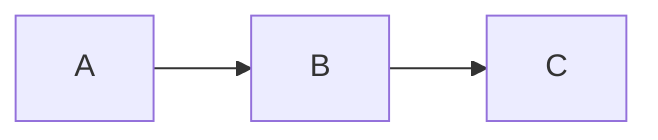
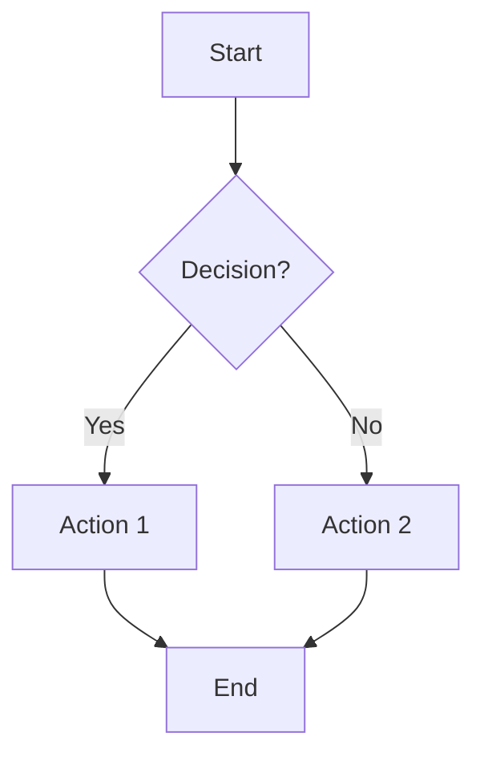
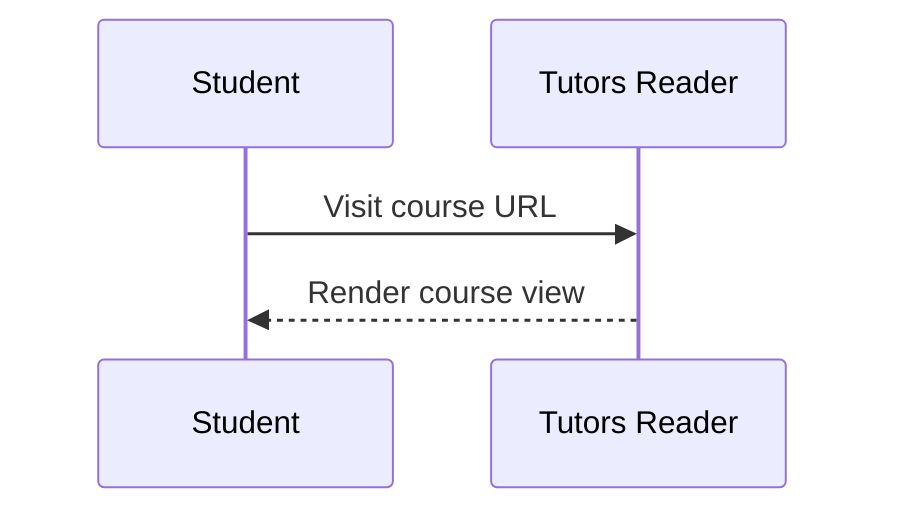
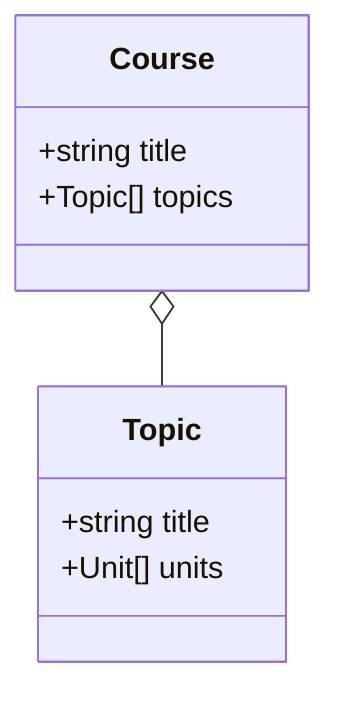

---
icon:
  type: material-icon-theme:mermaid
---

# Mermaid Diagrams

*How to include Mermaid diagrams in labs and notes*

---

[[toc]]

---

Tutors supports [Mermaid.js](https://mermaid.js.org/) diagrams directly in markdown content. You can include Mermaid diagrams in notes, labs, panel notes and any other markdown-based learning resource. No additional tooling or configuration is required - diagrams are rendered client-side.

| Example Resource                                             | Display                                                      |
| ------------------------------------------------------------ | ------------------------------------------------------------ |
| [Mermaid Diagrams](https://github.com/tutors-sdk/tutors-reference-course/blob/main/topic-01-typical/unit-1/book-a/08.08.md) | [Mermaid Example](https://tutors.dev/lab/reference-course/topic-01-typical/unit-1/book-a/08) |

# Usage

To include a diagram, use a standard fenced code block with the `mermaid` language identifier:

~~~

~~~

# Supported Diagram Types

The following Mermaid diagram types are supported:

| Diagram Type     | Use Case                           |
| ---------------- | ---------------------------------- |
| Flowchart        | Process flows and decision trees   |
| Sequence Diagram | Interactions between components    |
| Class Diagram    | Object-oriented structures         |
| State Diagram    | State machines and transitions     |
| ER Diagram       | Entity relationships               |
| Gantt Chart      | Project timelines                  |
| Pie Chart        | Proportional data                  |

# Examples

## Flowchart

~~~

~~~

## Sequence Diagram

~~~

~~~

## Class Diagram

~~~

~~~

Mermaid diagrams work wherever markdown is rendered in Tutors, including notes, lab steps, panel notes, and tutorials. See the full Mermaid documentation here:

- <https://mermaid.js.org/intro/>

